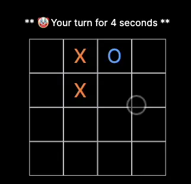

 

 
<h3> SUPER FAST, SUPER HARD TICTACTOE created by nowaveosu</h3>	
 

 
<h2> 🔗 Link </h2>
 
<ul>
    
    <li><a href="https://www.hyper-tictactoe.com" target="_blank">hyper-tictactoe.com</a>
</ul>
 
<h2> ⚙️ Stack </h2>
<ul>
    <h4>Client: TypeScript, Next.js, Tailwind-css </h4>
    <h4>Server:  Node.js, Socket.io</h4>
    <h4>Design: Figma, photoShop</h4>
    <h4>Deploy : vercel, cloudtype</h4>
</ul>
<h2>🗒️ Demo </h2>
<ul>
    <h4>If you want to test it alone, you can open two windows and enter the same room.</h4>
    <h4>만약 혼자서 테스트해보고 싶으시다면, 두개의 탭으로 웹사이트에 접속해서 같은 방에 들어가면 됩니다.</h4>
</ul>
