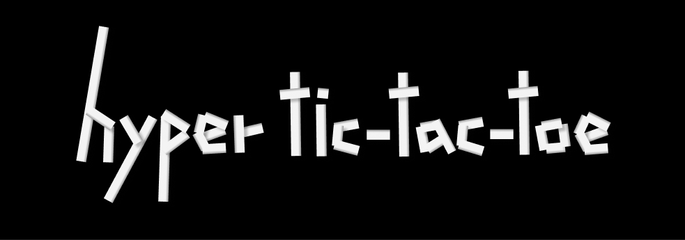

 

 
<h3> SUPER FAST, SUPER HARD TICTACTOE created by nowaveosu</h3>	
 

 
<h2> 🔗 Link </h2>
 
<ul>
    
    <li><a href="https://www.hyper-tictactoe.com" target="_blank">hyper-tictactoe.com</a>
</ul>
 
<h2> ⚙️ Stack </h2>
<ul>
    <h4>Client: TypeScript, Next.js, Tailwind-css </h4>
    <h4>Server:  Node.js, Socket.io</h4>
    <h4>Design: Figma, photoShop</h4>
    <h4>Deploy : vercel, cloudtype</h4>
</ul>
